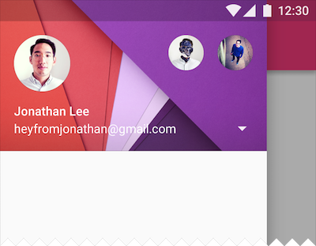
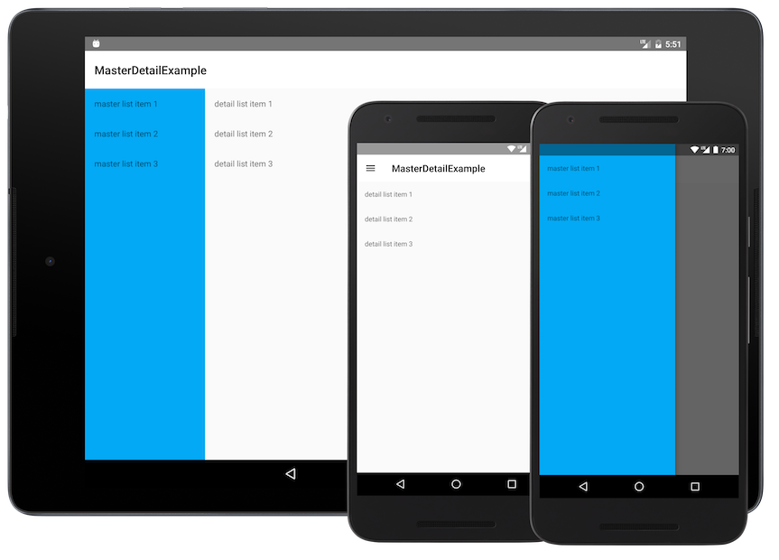
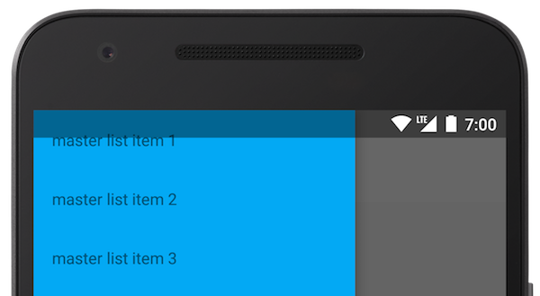
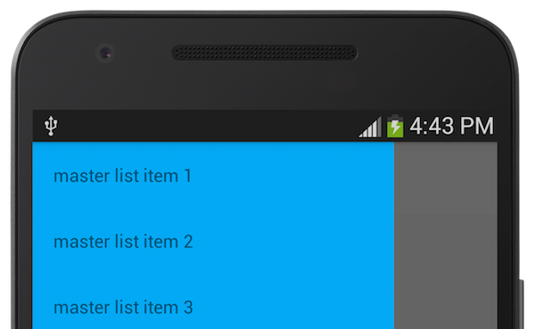
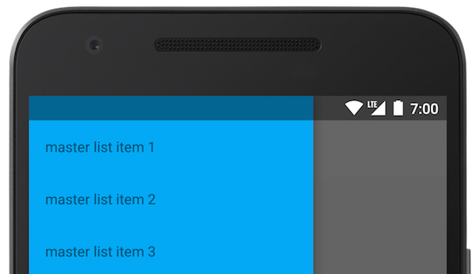

The navigation drawer pattern is ubiquitous on Android devices:



*Sample from Material Design.*

This pattern is easily implemented with the [Design Support Library](https://android-developers.googleblog.com/2015/05/android-design-support-library.html). The best walkthrough on how to build a navigation drawer is this [tutorial by CodePath](http://guides.codepath.com/android/fragment-navigation-drawer).

On larger devices though, hiding and showing the navigation drawer is unnecessary. With plenty of screen real estate, the drawer should just stay open all the time. The [Material Design specs](https://material.io/guidelines/patterns/navigation-drawer.html#navigation-drawer-behavior) even recommend this behavior. There are [ways](http://stackoverflow.com/a/18095111) to accomplish this "always open" behavior on tablets by using [DrawerLayout.LOCK_MODE_LOCKED_OPEN](https://developer.android.com/reference/android/support/v4/widget/DrawerLayout.html#LOCK_MODE_LOCKED_OPEN), but I found them a bit hacky and inelegant. Additionally by implementing CodePath's example, too much of the view logic would live in the hosted activity. I set out to see if I can use Fragments to solve this problem. Basically we will have a *master* fragment that will be used for the drawer view and a *detail* fragment for the main view. We'll then reuse these fragments in a classic master/detail arrangement on tablets.



*The end result.*

If you're unfamiliar with navigation drawers, I suggest you run through the CodePath tutorial first. It'll take you maybe 30 minutes and you'll have a better understanding of what we're going to do here.

Let's get started coding the building blocks of our app: the Fragments and their layouts. We are going to keep things real simple so the UI is a bit ugly. Let's first create the layouts for our master and detail fragments:

`fragment_master.xml`:

```
<?xml version="1.0" encoding="utf-8"?>
<LinearLayout xmlns:android="http://schemas.android.com/apk/res/android"
              android:layout_width="match_parent"
              android:layout_height="match_parent"
              android:background="@color/blue"
              android:orientation="vertical">

    <!-- Replace this simple list with recyclerview or however you
        want to generate your master list -->

    <TextView
        android:id="@+id/master_item_1"
        android:layout_width="match_parent"
        android:layout_height="wrap_content"
        android:padding="16dp"
        android:text="master list item 1"/>

    <TextView
        android:id="@+id/master_item_2"
        android:layout_width="match_parent"
        android:layout_height="wrap_content"
        android:padding="16dp"
        android:text="master list item 2"/>

    <TextView
        android:id="@+id/master_item_3"
        android:layout_width="match_parent"
        android:layout_height="wrap_content"
        android:padding="16dp"
        android:text="master list item 3"/>

</LinearLayout>
```

We'll set some background color so that we can easily distinguish the boundaries of our fragments. In this example I've got a simple list with three items. You can feel free to use a `RecyclerView` or `ScrollView` here depending on your needs.

Similarly for the detail screen:

`fragment_detail.xml`:

```
<?xml version="1.0" encoding="utf-8"?>
<LinearLayout xmlns:android="http://schemas.android.com/apk/res/android"
              android:layout_width="match_parent"
              android:layout_height="match_parent"
              android:orientation="vertical">

    <!-- Replace this simple list with recyclerview or however you
        want to generate your detail list -->

    <TextView
        android:id="@+id/detail_item_1"
        android:layout_width="wrap_content"
        android:layout_height="wrap_content"
        android:layout_margin="16dp"
        android:text="detail list item 1"/>

    <TextView
        android:id="@+id/detail_item_2"
        android:layout_width="wrap_content"
        android:layout_height="wrap_content"
        android:layout_margin="16dp"
        android:text="detail list item 2"/>

    <TextView
        android:id="@+id/detail_item_3"
        android:layout_width="wrap_content"
        android:layout_height="wrap_content"
        android:layout_margin="16dp"
        android:text="detail list item 3"/>

</LinearLayout>
```

Again replace the detail list with whatever you want in the detail screen.

Now let's wire these layouts up to our Fragments:

`MasterFragment.java`:

```
public class MasterFragment extends Fragment {

    public static MasterFragment newInstance() {
        return new MasterFragment();
    }

    @Nullable
    @Override
    public View onCreateView(LayoutInflater inflater, 
                             @Nullable ViewGroup container, 
                             @Nullable Bundle savedInstanceState) {
        
        View view = inflater.inflate(R.layout.fragment_master, container, false);

        TextView textView1 = (TextView) view.findViewById(R.id.master_item_1);
        textView1.setOnClickListener(new View.OnClickListener() {
            @Override
            public void onClick(View v) {
                // TODO
            }
        });

        TextView textView2 = (TextView) view.findViewById(R.id.master_item_2);
        textView2.setOnClickListener(new View.OnClickListener() {
            @Override
            public void onClick(View v) {
                // TODO
            }
        });

        TextView textView3 = (TextView) view.findViewById(R.id.master_item_3);
        textView3.setOnClickListener(new View.OnClickListener() {
            @Override
            public void onClick(View v) {
                // TODO
            }
        });

        return view;
    }
}

```

`DetailFragment.java`:

```
public class DetailFragment extends Fragment {

    private TextView textView1;
    private TextView textView2;
    private TextView textView3;
    private int nonSelectedColor;
    private int selectedColor;

    public static DetailFragment newInstance() {
        return new DetailFragment();
    }

    @Nullable
    @Override
    public View onCreateView(LayoutInflater inflater,
                             @Nullable ViewGroup container,
                             @Nullable Bundle savedInstanceState) {
                             
        View view = inflater.inflate(R.layout.fragment_detail, container, false);

        textView1 = (TextView) view.findViewById(R.id.detail_item_1);
        textView2 = (TextView) view.findViewById(R.id.detail_item_2);
        textView3 = (TextView) view.findViewById(R.id.detail_item_3);

        selectedColor = ContextCompat.getColor(getContext(), R.color.red);
        nonSelectedColor = ContextCompat.getColor(getContext(), R.color.black);

        return view;
    }
}
```

For this simple example, we are going to update the *detail* text color based on the selected *master* item. This will just be a simple way to observe sending information from `MasterFragment` to `DetailFragment`.

Now we need to host these two fragments in our `Activity`, but first let's create the layout for this activity:

`activity_main.xml`:

```
<android.support.v4.widget.DrawerLayout
    xmlns:android="http://schemas.android.com/apk/res/android"
    android:id="@+id/drawer_layout"
    android:layout_width="match_parent"
    android:layout_height="match_parent">

    <LinearLayout
        android:layout_width="match_parent"
        android:layout_height="match_parent"
        android:orientation="vertical">

        <android.support.v7.widget.Toolbar
            android:id="@+id/toolbar"
            android:layout_width="match_parent"
            android:layout_height="wrap_content"
            android:background="@color/white"
            android:fitsSystemWindows="true"
            android:minHeight="?attr/actionBarSize"/>

        <FrameLayout
            android:id="@+id/detail_fragment_container"
            android:layout_width="match_parent"
            android:layout_height="match_parent"/>

    </LinearLayout>

    <!-- The navigation drawer that comes from the left -->
    <!-- Note that `android:layout_gravity` needs to be set to 'start' -->
    <android.support.design.widget.NavigationView
        android:id="@+id/master_fragment_container"
        android:layout_width="wrap_content"
        android:layout_height="match_parent"
        android:layout_gravity="start"
        android:fitsSystemWindows="true">

    </android.support.design.widget.NavigationView>
    
</android.support.v4.widget.DrawerLayout>
```

There's a lot going on here. If you have used navigation drawers before, or you read through the CodePath example, some of this should look familiar. We need to set a `DrawerLayout` as our root view. We then need add a `FrameLayout`  as the container to insert our **detail** fragment. Now here' the cool part. Instead of including a `ListView` inside `NavigationView`, we'll actually use the `NavigationView` as another container, this time for our **master** fragment.

So now we can wire all this up inside our Activity:

`MainActivity.java`:

```
public class MainActivity extends AppCompatActivity {

    private static final String TAG_MASTER_FRAGMENT = "TAG_MASTER_FRAGMENT";
    private static final String TAG_DETAIL_FRAGMENT = "TAG_DETAIL_FRAGMENT";

    private DrawerLayout drawerLayout;

    @Override
    protected void onCreate(@Nullable Bundle savedInstanceState) {
        super.onCreate(savedInstanceState);

        setContentView(R.layout.activity_main);

        // setup toolbar
        Toolbar toolbar = (Toolbar) findViewById(R.id.toolbar);
        setSupportActionBar(toolbar);

        // setup drawer view
        drawerLayout = (DrawerLayout) findViewById(R.id.drawer_layout);
        NavigationView navigationView = (NavigationView) findViewById(R.id.master_fragment_container);
        navigationView.setNavigationItemSelectedListener(new NavigationView.OnNavigationItemSelectedListener() {
            @Override
            public boolean onNavigationItemSelected(@NonNull MenuItem item) {
                return true;
            }
        });

        // setup menu icon
        final ActionBar actionBar = getSupportActionBar();
        if (actionBar != null) {
            actionBar.setHomeAsUpIndicator(R.drawable.ic_menu_black_24dp);
            actionBar.setDisplayHomeAsUpEnabled(true);
        }

        // insert detail fragment into detail container
        DetailFragment detailFragment = DetailFragment.newInstance();
        FragmentManager fragmentManager = getSupportFragmentManager();
        fragmentManager.beginTransaction()
                .add(R.id.detail_fragment_container, detailFragment, TAG_DETAIL_FRAGMENT)
                .commit();

        // insert master fragment into master container (i.e. nav view)
        MasterFragment masterFragment = MasterFragment.newInstance();
        fragmentManager.beginTransaction()
                .add(R.id.master_fragment_container, masterFragment, TAG_MASTER_FRAGMENT)
                .commit();
    }

    @Override
    public boolean onOptionsItemSelected(MenuItem item) {
        // The action bar home/up action should open or close the drawer.
        switch (item.getItemId()) {
            case android.R.id.home:
                drawerLayout.openDrawer(GravityCompat.START);
                return true;
        }

        return super.onOptionsItemSelected(item);
    }
}	
```

Again a lot of this comes from the CodePath example: 

* setting up the toolbar
* setting up the drawer view
* setting up the menu icon
* setting up `onOptionsItemSelected`

The important parts of using fragments is creating our master and detail fragments and using fragment transactions to insert them into their respective containers. We'll also add fragment tags so that we can easily find our fragments later.

Next we need to pass the clicked item ID from the master fragment "up" to our activity and then "down" to the detail fragment. We can use fragment callbacks to pass the item ID up to the activity. We can then add a public method on `DetailFragment` for the activity to pass the ID to the detail fragment. I won't go into details about how to set this up. Chances are you've done this before. Feel free to catch up [here](https://developer.android.com/training/basics/fragments/communicating.html).

 So our fragments and activity becomes:

`MasterFragment.java`:
<pre>
public class MasterFragment extends Fragment {

    <b>private Callbacks callbacks;

    interface Callbacks {
        void onMasterItemClicked(int masterItemId);
    }</b>

    @Nullable
    @Override
    public View onCreateView(LayoutInflater inflater,
                             @Nullable ViewGroup container,
                             @Nullable Bundle savedInstanceState) {

        View view = inflater.inflate(R.layout.fragment_master, container, false);

        TextView textView1 = (TextView) view.findViewById(R.id.master_item_1);
        textView1.setOnClickListener(new View.OnClickListener() {
            @Override
            public void onClick(View v) {
                <b>callbacks.onMasterItemClicked(1); // repeat for other textViews</b>
            }
        });

		...
		
        return view;
    }
}
</pre>


`MainActivity.java`:
<pre>
public class MainActivity extends AppCompatActivity <b>implements MasterFragment.Callbacks</b> {

	...

    <b>@Override
    public void onMasterItemClicked(int masterItemId) {
        DetailFragment detailFragment = 
        	(DetailFragment) getSupportFragmentManager().findFragmentByTag(TAG_DETAIL_FRAGMENT);
        	
        detailFragment.onMasterItemClicked(masterItemId);

        // Close the navigation drawer
        drawerLayout.closeDrawers();
     }</b>
}
</pre>


`DetailFragment.java`:
<pre>
public class DetailFragment extends Fragment {
	
	...

	<b>public void onMasterItemClicked(int masterId) {
        // reset colors
        textView1.setTextColor(nonSelectedColor);
        textView2.setTextColor(nonSelectedColor);
        textView3.setTextColor(nonSelectedColor);

        switch (masterId) {
            case 1:
                textView1.setTextColor(selectedColor);
                break;
            case 2:
                textView2.setTextColor(selectedColor);
                break;
            case 3:
                textView3.setTextColor(selectedColor);
                break;
            default:
                Log.d(TAG, "unknown master ID");
        }
    }</b>
}
</pre>

At this point we've basically reproduced the functionality of the CodePath example but with Fragments. We don't yet have anything to show for our extra work. So now is the time to re-use our master and detail fragments to make the UI look different on larger screens.

We are going to use resource qualifiers to supply a different version of `activity_main.xml` on screens with a smallest width greater than 600dp. This is a good initial guess at tablet size.

So create a resource directory `src/main/res/layout-sw600dp` and inside it create a new `activity_main.xml`

`layout-sw600dp/activity_main.xml`:

```
<LinearLayout
    xmlns:android="http://schemas.android.com/apk/res/android"
    android:layout_width="match_parent"
    android:layout_height="match_parent"
    android:orientation="vertical">

    <android.support.v7.widget.Toolbar
        android:id="@+id/toolbar"
        android:layout_width="match_parent"
        android:layout_height="wrap_content"
        android:background="@color/white"
        android:minHeight="?attr/actionBarSize"/>

    <LinearLayout
        android:layout_width="match_parent"
        android:layout_height="match_parent"
        android:orientation="horizontal">

        <FrameLayout
            android:id="@+id/master_fragment_container"
            android:layout_width="0dp"
            android:layout_height="match_parent"
            android:layout_weight="1"/>

        <FrameLayout
            android:id="@+id/detail_fragment_container"
            android:layout_width="0dp"
            android:layout_height="match_parent"
            android:layout_weight="4"/>

    </LinearLayout>
    
</LinearLayout>
```

This is a much simpler layout than `layout/activity_main.xml`. Again we still have two containers for master and detail fragments. Note that the `id`s need to match what we had in `layout/activity_main.xml`. We also need the `Toolbar`. Lastly we need to decide the relative spacing of the master/detail. I've quickly chosen a 1:4 split by using `layout_weight`. This is really up to you. You may decide to just wrap width of the master container and give all the remaining width to the detail. It's up to you.

Now we need to head back to our Activity and make sure it can handle this new layout. We need to make just a few changes

`MainActivity.java`:

<pre>
public class MainActivity extends AppCompatActivity implements MasterFragment.Callbacks {

    private static final String TAG_MASTER_FRAGMENT = "TAG_MASTER_FRAGMENT";
    private static final String TAG_DETAIL_FRAGMENT = "TAG_DETAIL_FRAGMENT";

    private DrawerLayout drawerLayout;

    @Override
    protected void onCreate(@Nullable Bundle savedInstanceState) {
        super.onCreate(savedInstanceState);

        setContentView(R.layout.activity_main);

        // setup toolbar
        Toolbar toolbar = (Toolbar) findViewById(R.id.toolbar);
        setSupportActionBar(toolbar);

        drawerLayout = (DrawerLayout) findViewById(R.id.drawer_layout);
        <b>if (drawerLayout != null) {</b>
            // setup drawer view
            NavigationView navigationView = (NavigationView) findViewById(R.id.master_fragment_container);
            navigationView.setNavigationItemSelectedListener(new NavigationView.OnNavigationItemSelectedListener() {
                @Override
                public boolean onNavigationItemSelected(@NonNull MenuItem item) {
                    return true;
                }
            });

            // setup menu icon
            final ActionBar actionBar = getSupportActionBar();
            if (actionBar != null) {
                actionBar.setHomeAsUpIndicator(R.drawable.ic_menu_black_24dp);
                actionBar.setDisplayHomeAsUpEnabled(true);
            }
        <b>}</b>

        // insert detail fragment into detail container
        DetailFragment detailFragment = DetailFragment.newInstance();
        FragmentManager fragmentManager = getSupportFragmentManager();
        fragmentManager.beginTransaction()
                .add(R.id.detail_fragment_container, detailFragment, TAG_DETAIL_FRAGMENT)
                .commit();

        // insert master fragment into master container (i.e. nav view)
        MasterFragment masterFragment = MasterFragment.newInstance();
        fragmentManager.beginTransaction()
                .add(R.id.master_fragment_container, masterFragment, TAG_MASTER_FRAGMENT)
                .commit();
    }
    
    ...
    
    @Override
    public void onMasterItemClicked(int masterItemId) {
        DetailFragment detailFragment = (DetailFragment) getSupportFragmentManager()
                .findFragmentByTag(TAG_DETAIL_FRAGMENT);
        detailFragment.onMasterItemClicked(masterItemId);

        // Close the navigation drawer
        <b>if (drawerLayout != null) {</b>
            drawerLayout.closeDrawers();
        <b>}</b>
    }
}
</pre>

All we need to do is null check `drawerLayout` before setting up drawer view and menu icon and before we try to close the drawer. If Android decides to use our `layout/activity_main.xml`, then the view hierarchy will contain a view with id `drawer_layout`. If Android decides to use `layout-sw600dp/activity_main.xml`, then the view hierarchy will NOT contain a view with that id. In other words, we are able to use the presence of `drawerLayout` as an indication of whether we're on a large screen or not.

At this point we are almost wrapped up. Checking our results on several phones and tablets shows that things are working as expected.


*Navigation drawer on phone and master/detail on tablet.*


Bonus Round
----

There are two small things bothering me. First let's compare the navigation drawer to pre-API 19 devices with newer ones:



*Yuck! Navigation drawer looks terrible on devices API 19 and newer.*



*Looks fine on devices older than API 19.*

When we followed the CodePath example we used a transparent status bar on API 19+ devices (see `android:windowTranslucentStatus` in `values-v19/styles.xml`). This allowed the navigation drawer to slide "under" the status bar. This matches the material design specs. However on these newer devices, if our drawer content is too near the top it will get partially obscured by the status bar. I've actually seen this on a few production apps I use personally. Fixing this problem is quite easy though. We will supply some top padding to the root view in `fragment_detail.xml`, **but only for API 19+ devices that are using the navigation drawer** (i.e. devices with smallest width less than 600dp).

`fragment_detail.xml`:

```
<?xml version="1.0" encoding="utf-8"?>
<LinearLayout xmlns:android="http://schemas.android.com/apk/res/android"
              android:layout_width="match_parent"
              android:layout_height="match_parent"
              android:background="@color/blue"
              android:paddingTop="@dimen/nav_drawer_top_padding" <!-- add this line -->
              android:orientation="vertical">
 ...              
 
```

To do this we'll use two more qualified resource directories. First let's set the dimension for API19+ devices

`values-v19/dimens.xml`:

```
<?xml version="1.0" encoding="utf-8"?>
<resources>
    <!-- on api 19+ devices nav drawer will go "under" status bar, 
    	so we need to push down content -->
    <dimen name="nav_drawer_top_padding">24dp</dimen>
</resources>
```

Then we need to supply a default value:

`values/dimens.xml`:

```

<?xml version="1.0" encoding="utf-8"?>
<resources>
    <!-- on devices older than API 19, we don't need to pad top 
 	   of nav drawer since nav drawer won't go "under" status bar -->
    <dimen name="nav_drawer_top_padding">0dp</dimen>
</resources>
```

Now lastly you'll notice that on devices that are API 19+ but also tablets (sw > 600dp) we'll add padding when we don't want to. So we'll revert back to 0dp on tablets:

`values-sw600dp/dimens.xml`:

```
<?xml version="1.0" encoding="utf-8"?>
<resources>
    <!-- we don't need nav drawer top padding on sw600dp + 
    	because we'll never show nav drawer -->
    <dimen name="nav_drawer_top_padding">0dp</dimen>
</resources>
```

This works because smallest width qualifiers are checked before API version qualifiers. So if we are on an API 19+ tablet, we'll hit the `sw600dp` bin first and get 0dp padding, and never access the `v19` bin. The navigation drawer is now looking good on API 19+ phones.



*Navigation drawer finally looks good on phones that are API 19 and newer.*

The second problem involves tablets that are API 19+. Here we see that the Toolbar is slid up under the transparent status bar. This is also caused by `android:windowTranslucentStatus`. 


*Yuck! Toolbar looks terrible on tablets that are API 19 and newer.*

The solution is to disable this style for tablets. Within the `values-sw600dp` directory create a new `styles.xml` file and copy the default style from `values/styles.xml`:

`values-sw600dp/styles.xml`:

```
<resources>
    <style name="AppTheme" parent="Theme.AppCompat.Light.NoActionBar"/>
</resources>
```

Now things are working great!


*Finally looks good on tablets too.*


That's it. Now everything looks perfect on old and new phones and old and new tablets! Get the sourcecode for this project [here](https://github.com/tir38/android-master-detail-nav-drawer).


 